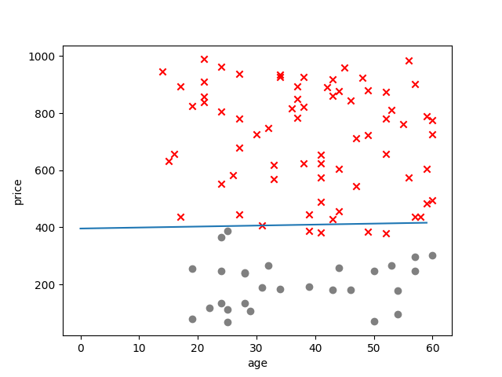

## PLA的基本思路
* 每个特征都有权重，表示该特征的重要程度，当综合所有的特征与权重计算一个最终分分数，当这个分数超过某个阈值，表示成功，否则表示失败
## PLA的算法步骤
* step1: 随便找一条直线，记随便找一个n维向量w，赋初值
* step2: 如果这条直线正好把训练数据正确切分，训练结束
* step3: 如果有一个样本没有被正确的切分，即在权值计算中对权值进行一些修正
* step4: 跳转到step2
## 数据结构
```
******************************
* age * price ***   click    *
******************************
* 23  * 234   ***    1       *
* 12  * 435   ***   -1       *
* 45  * 264   ***    1       *
******************************
```
## 数据的合成
本次实验数据是用一个公式 3.14x + 2.3y - 1000合成的数据，并且将数据保存在一个xls文件当中，然后在从这个文件获得数据。
## 权值修正方法
wi = wi + weight_change
weight_change = learning_rate(label - prediction)
label: 代表的就是click
prediction: 代表的就是你这个预测的值
## 具体参考博客
一定要看博客：http://geek.csdn.net/news/detail/172477
## 最终结果
